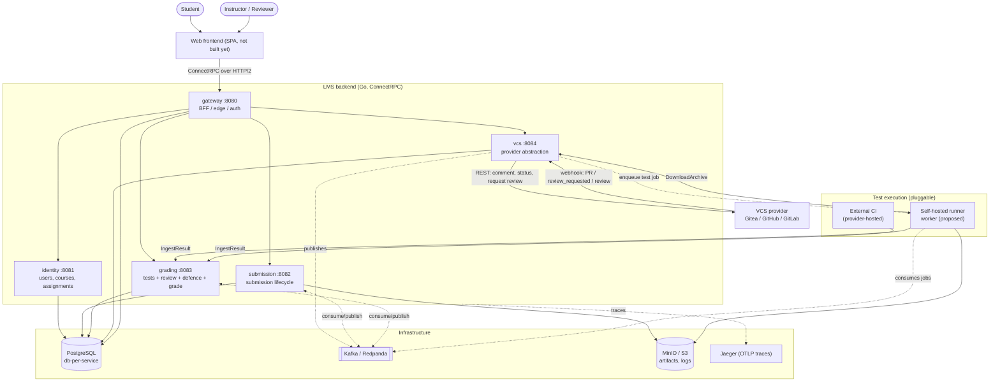
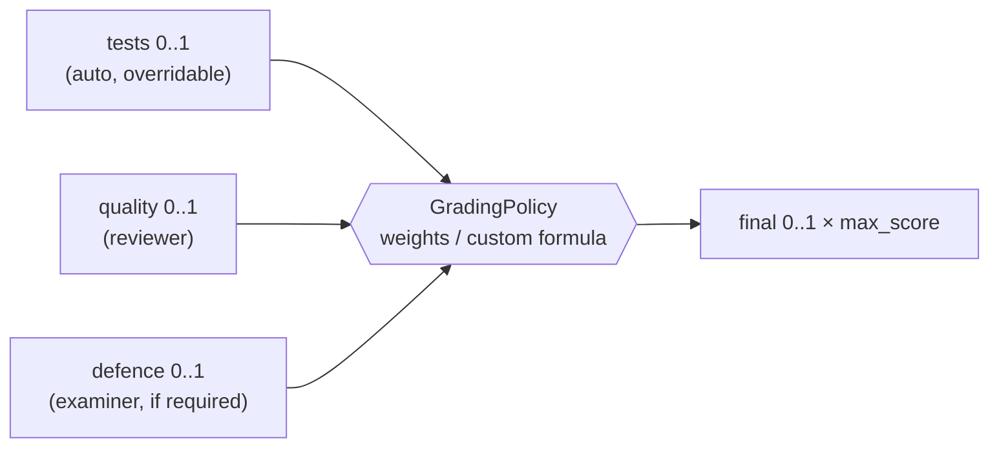
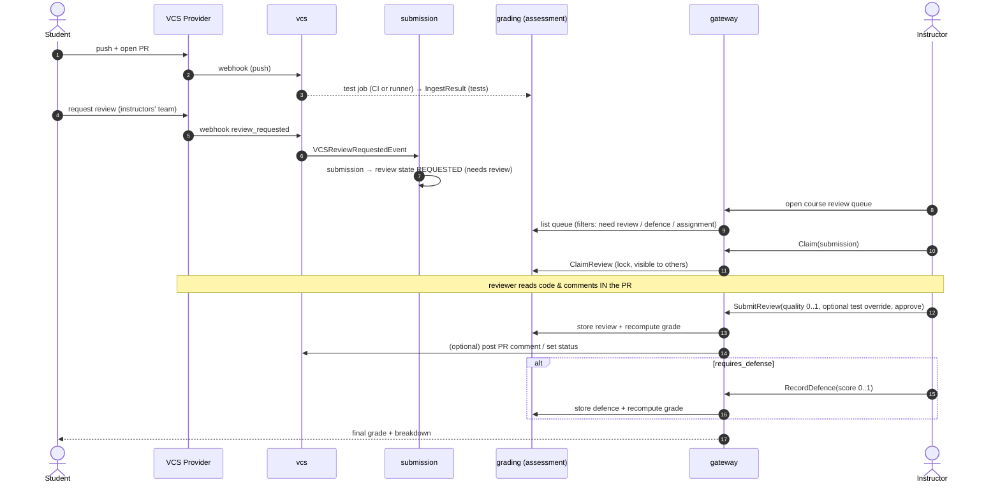
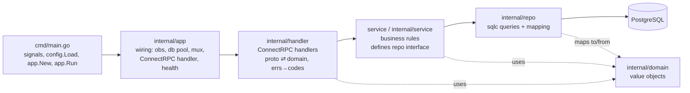
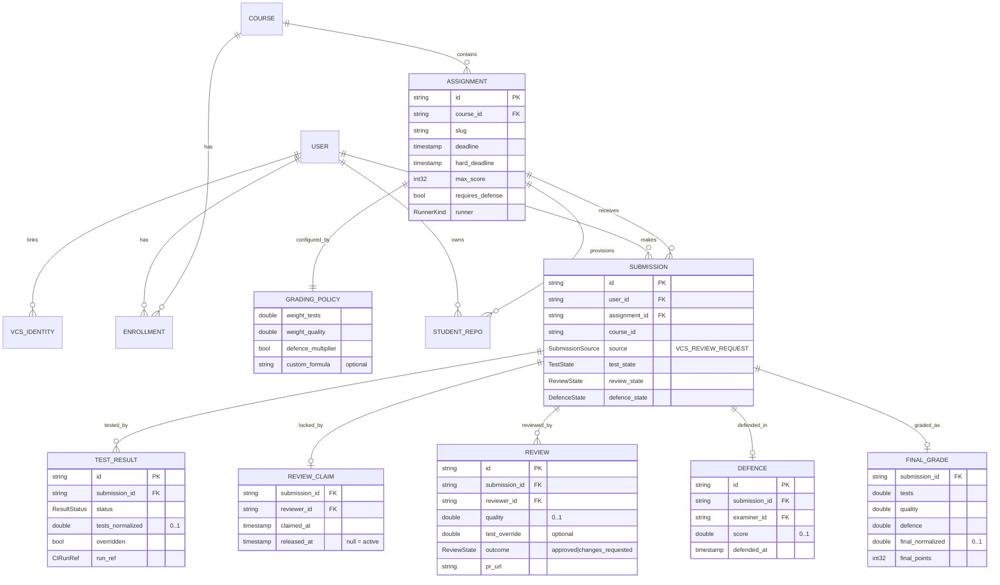
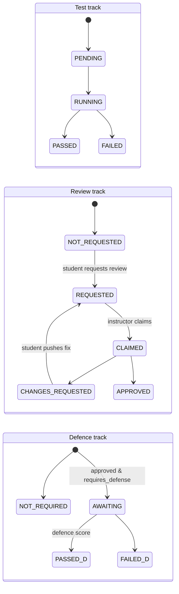

# Architecture

> Status: early development. This describes the **intended** architecture; where
> reality differs, it's called out. Source of truth for every API is
> `proto/lms/v1/*.proto`. See also [`plan.md`](plan.md) and the root
> [`CLAUDE.md`](../CLAUDE.md).
>
> ℹ️ Human review, defence, review claiming and grading policy are now **encoded
> in the proto contracts** (Phase 0 — see `identity`/`submission`/`grading`/`gateway`
> protos and [§11 Contract changes](#11-contract-changes)). They are **contract-only**
> so far — no service implements them yet. The **self-hosted runner** (and its
> `vcs.EnqueueTestJob` / test-job topic) remains **(proposed)**, to land with the
> runner itself.

## 1. What the system does

An LMS for **programming courses where students submit work through their own Git
repositories** and are graded by a **combination of automated tests, human code
review, and an oral defence** — roughly *GitHub Classroom + an autograder + a
review/defence workflow*, self-hostable across multiple VCS providers (Gitea /
GitHub / GitLab).

The loop the whole design serves:

```
instructor defines course + assignment
   (template repo, deadline, max score, requires_defense?, grading policy, runner)
        ↓
student enrolls, links a VCS identity (OAuth), gets a repo from the template
        ↓
student opens a PR and REQUESTS REVIEW from the instructors' team
   (this IS the submission — there is no "submit" button)
        ↓
tests run (external CI *or* our own runner)  →  test score (0..1)
        ↓
an instructor CLAIMS the submission (visible to other instructors),
reviews the code in the PR, then in the LMS sets code-quality (0..1)
and may override the test score
        ↓
if the assignment requires defence: student defends → defence score (0..1)
        ↓
final grade = grading policy over {tests, quality, defence}
```

## 2. System context



## 3. Services

| Service | Port | Owns (DB) | Responsibility |
|---------|------|-----------|----------------|
| **gateway** | 8080 | `lms_gateway` | Edge/BFF. Auth (Login / RefreshToken / Whoami), **student** dashboard, **instructor** review queue & grading screens. Fans out to the other services. |
| **identity** | 8081 | `lms_identity` | Users, VCS identities, courses, enrollments, **assignments (incl. `requires_defense`, grading policy, runner kind)**, student repos. Only service with real logic today (users only). |
| **submission** | 8082 | `lms_submission` | Submission lifecycle. A submission is created/updated from VCS **review-request** events (and pushes). Tracks orthogonal states (test / review / defence). |
| **grading** | 8083 | `lms_grading` | **Assessment**: auto test results, **manual score overrides**, **human reviews (code-quality 0..1)**, **review claims**, **defence records**, and **final-grade computation** per the assignment's grading policy. |
| **vcs** | 8084 | `lms_vcs` | Provider abstraction. Verifies + normalizes webhooks (incl. `review_requested` / `review_submitted`), provisions repos, posts PR comments / commit status, requests reviewers, OAuth, archive download, **enqueues test jobs for the self-hosted runner**. |

> The **self-hosted runner** is a new component (proposed) — likely a worker in
> `workers/` (currently empty). It pulls the repo archive from `vcs`, runs the
> assignment's tests in a sandbox, uploads logs to MinIO, and calls
> `grading.IngestResult`. The same `IngestResult` contract is used whether tests
> ran in external CI or our runner — so the two are interchangeable per
> assignment.

> Reality check: only `identity` has business logic — but it now implements its
> whole RPC surface (users, courses, enrollments, assignments, VCS identities,
> student repos). Everything else is an app+handler skeleton returning
> `Unimplemented`; the runner doesn't exist yet.

## 4. Assessment model (grade composition)

A submission's final grade is computed from **three normalized components**, each
in `[0, 1]`:

| Component | Source | Who/what sets it |
|-----------|--------|------------------|
| `tests` | automated tests (CI or runner) → `grading.IngestResult` | machine; an instructor may **override** |
| `quality` | human code review | the reviewing instructor (0..1 for code quality) |
| `defence` | oral defence | the examining instructor (0..1), only if `requires_defense` |

**Grading policy** lives on the **Assignment** and is customizable:

- **Default:** weighted sum of tests & quality, multiplied by defence —
  matching the reference course:

  ```
  final = (w_tests · tests + w_quality · quality) · defence_factor
  where defence_factor = requires_defense ? defence : 1
  ```

- **Per-assignment weights** `w_tests`, `w_quality` (sum need not be 1; defaults
  e.g. 0.7 / 0.3).
- **Custom formula (optional):** an instructor can supply an expression over the
  variables `tests`, `quality`, `defence` (each 0..1) that overrides the weighted
  default — e.g. `min(tests, quality) * defence`. Requires a **safe expression
  evaluator** (no arbitrary code); the set of allowed functions/operators is
  fixed.
- The normalized `final` (0..1) is multiplied by the assignment's `max_score`
  for display.



## 5. Submission = "request review on the PR"

There is **no submit button**. The canonical submission signal is the student
**requesting review from the instructors' team** on their pull request. Mechanics:

1. Student pushes to their repo and opens a PR.
2. Tests run automatically on push (CI or our runner) → test score attaches to the
   commit/PR.
3. Student **requests review** from the course's reviewer team/users on the PR.
4. The provider fires a `review_requested` webhook → `vcs` normalizes it
   (`EVENT_KIND_REVIEW_REQUESTED`) → event → `submission` creates/updates a
   submission with **source = `VCS_REVIEW_REQUEST`** and review state
   **`REQUESTED`** (i.e. it shows up as *needs review*).
5. Pushing new commits after a "changes requested" review re-runs tests and
   re-opens the review.

> A web upload path (`gateway.SubmitFromWeb`) may remain as a rare fallback (e.g.
> provider outage), but it is **not** the primary flow and the UI should not
> present it as the main way to submit.

## 6. Review, claiming & defence (multi-instructor)

Because a course can have **several instructors**, review work must be
coordinated so two people don't grade the same submission.

- **Review claim (lock):** an instructor **claims** a submission for review. The
  claim is visible to all instructors (`claimed_by`, `claimed_at`), so the queue
  shows "being reviewed by X". Claims can be **released** or time out.
- **Review:** the reviewer opens the PR (deep link), leaves comments **in the
  PR** (via the provider), then in the LMS records **code-quality (0..1)**, may
  **override the test score**, and marks the review **approved** or **changes
  requested**.
- **Defence:** if the assignment `requires_defense`, after review the submission
  enters **awaiting defence**; an examiner records a **defence score (0..1)**
  (pass/fail is just defence ∈ {0,1}).
- **Final grade** is (re)computed by the grading policy whenever a component
  changes.



## 7. Per-service internal layout

Every service module is structured the same way:



Rules: dependencies point **inward**; `service` imports neither ConnectRPC nor
SQL; **interfaces live at the consumer**; sentinel errors per layer, wrapped with
`%w`, mapped to Connect codes only in the handler.

> Note: identity's business layer lives in `internal/service/` (moved there in
> Phase 1). Keep new services under `internal/`.

## 8. Domain model



Service/DB boundaries: USER/VCS_IDENTITY/COURSE/ENROLLMENT/ASSIGNMENT/
GRADING_POLICY/STUDENT_REPO → `identity`; SUBMISSION (+ states) → `submission`;
TEST_RESULT/REVIEW_CLAIM/REVIEW/DEFENCE/FINAL_GRADE → `grading`. Cross-service
references are **by ID only** (no FKs across databases).

## 9. Submission lifecycle (orthogonal states)

Rather than one giant enum, a submission carries three **independent** tracks; the
UI derives an overall status and queue filters from them.



Queue filters map to these: **need review** = `review = REQUESTED` & no active
claim; **under review** = active claim; **defence** = `defence = AWAITING`; plus
filter **by assignment** / by student. "Done" = `APPROVED` and (defence not
required or scored).

## 10. Auth, eventing & cross-cutting

**Auth** — `Login` accepts a VCS OAuth code *or* email+password; returns a JWT
HS256 access token (`pkg/jwt`) + refresh token (stored in `lms_gateway`),
validated by a Connect interceptor (`pkg/grpcauth`, currently a stub). Roles are
per-course (`Role` = student / instructor / admin); review/grading endpoints are
instructor-gated.

**Eventing** (Kafka/Redpanda via franz-go, `EventEnvelope`, transactional
outbox `pkg/outbox`): `vcs` publishes `VCSEventReceived`,
`VCSReviewRequestedEvent`, `VCSReviewSubmittedEvent`, `StudentRepoProvisioned`;
`submission` consumes those and publishes `SubmissionCreated/Updated`; `grading`
consumes test/review/defence changes and publishes `GradingResultEvent`. A
**test-job topic** (proposed) feeds the self-hosted runner.

**Other:** ConnectRPC over h2c; config via `caarlos0/env`; pgx/v5 + sqlc +
golang-migrate (db-per-service); slog + OpenTelemetry → Jaeger; ULID ids;
MinIO/S3 for artifacts and runner logs.

## 11. Contract changes

**Landed (Phase 0)** — the design above is now in `proto/lms/v1/*` (contract-only;
no implementation yet). Keep proto-first when implementing:

- **`common.proto`:** `GradingPolicy` (`double weight_tests`,
  `double weight_quality`, `bool defence_multiplier`, `string custom_formula`) —
  shared by identity (assignment config) and grading (final-grade computation).
- **`identity.proto` · Assignment:** added `bool requires_defense`,
  `GradingPolicy grading_policy`, and `RunnerKind runner`
  (`RUNNER_KIND_EXTERNAL_CI` / `RUNNER_KIND_SELF_HOSTED`); same fields on
  `CreateAssignmentRequest`. (`auto_request_review_on_pass` already existed.)
- **`grading.proto` (assessment):** `ListReviewQueue` (filters: course,
  assignment, student, `ReviewQueueFilter` need-review/under-review/defence,
  claimed_by); `ClaimReview` / `ReleaseReview` (visible lock); `SubmitReview`
  (`quality` 0..1, optional `test_override`, `ReviewOutcome`); `OverrideTestScore`;
  `RecordDefence` (`score` 0..1); `GetFinalGrade`. New messages: `ReviewClaim`,
  `Review`, `Defence`, `FinalGrade`, `ReviewQueueItem`.
- **`submission.proto`:** the single `SubmissionState` is replaced by three
  orthogonal track enums — `TestState`, `ReviewTrackState` (named to avoid
  colliding with vcs `ReviewState`), `DefenceState` — on `Submission`,
  `ListSubmissionsRequest` filters, `SubmissionStatus`, and `UpdateStateRequest`.
- **`gateway.proto`:** instructor BFF — `ListCourseSubmissions` (filters + who
  claimed, returns `CourseSubmissionCard`), `ClaimSubmission`/`ReleaseClaim`,
  `SubmitReview`, `RecordDefence`, `OverrideTestScore`, and `CourseGradeOverview`.
  The acting reviewer/examiner is taken from the auth context, not the request.

**Still proposed** (not in proto — lands with the component):

- **`vcs.proto`:** an `EnqueueTestJob` / job topic for the self-hosted runner.
  `review_requested` handling is already modeled (`EVENT_KIND_REVIEW_REQUESTED`).

## 12. Tech stack summary

| Concern | Choice |
|--------|--------|
| Language / workspace | Go 1.26, `go.work` multi-module, `github.com/Mond1c/lms` |
| RPC | ConnectRPC (HTTP/2 h2c) |
| Schemas / codegen | Protobuf + buf → `gen/go` |
| DB | PostgreSQL, pgx/v5, sqlc, golang-migrate (db-per-service) |
| Messaging | Kafka / Redpanda (franz-go) + transactional outbox |
| Test execution | Pluggable: external CI **or** self-hosted runner (worker) |
| Auth | JWT HS256, bcrypt, per-course roles |
| Observability | slog + OpenTelemetry + Jaeger |
| Object store | MinIO / S3 (artifacts, runner logs) |
| Tests | testify, testcontainers (Postgres) |
| Local dev | docker-compose, Makefile |
