# Project plan & roadmap

> Working plan for the LMS — for both humans and agents. Pairs with
> [`architecture.md`](architecture.md) and the root [`CLAUDE.md`](../CLAUDE.md).
> Checkboxes reflect current reality; phases past "now" are proposed, not
> committed. Keep this file updated as work lands.

## 1. Where we are now

```mermaid
flowchart LR
    subgraph done["✅ Done"]
        a["proto contracts (all 5 services)"]
        b["go.work + per-service modules"]
        c["shared pkg: pg, obs, jwt, kafka"]
        d["docker-compose infra"]
        e["identity: User + Course + Enroll +<br/>Assignment + VCSIdentity + StudentRepo<br/>(handler→service→repo→sqlc)"]
        f["health/readiness + e2e smoke"]
    end
    subgraph wip["🚧 In progress / skeleton"]
        g["gateway/submission/grading/vcs<br/>(app+handler stubs)"]
        h["pkg/outbox, pkg/grpcauth<br/>(version stubs)"]
    end
    subgraph todo["⬜ Not started"]
        j["Kafka producers/consumers"]
        k["web frontend"]
        l["CI/CD, golangci-lint gate"]
    end
    done --> wip --> todo
```

**Build/test status (verified):** `identity` builds and is lint-clean; all of
`User/Course/Enrollment/Assignment/VCSIdentity/StudentRepo` are implemented
end-to-end with passing `service` unit tests and `repo` integration tests
(testcontainers Postgres). The historical `NewEmail` bug (commit `85b6cdf`) is fixed.

## 2. Component status

| Area | Status | Notes |
|------|:------:|-------|
| Proto contracts | ✅ | `proto/lms/v1/*` — full surface defined |
| Workspace / modules | ✅ | `go.work`, replace-directives wired |
| `pkg/pg`, `pkg/obs` | ✅ | pool, migrate, slog+OTel |
| `pkg/jwt` | ✅ | HS256 sign/verify + tests |
| `pkg/kafka` | ✅ | producer/consumer constructors |
| `pkg/outbox` | 🚧 | version stub only |
| `pkg/grpcauth` | 🚧 | version stub only — **no auth interceptor yet** |
| identity · User | ✅ | full vertical slice |
| identity · Course/Enroll/Assignment/StudentRepo/VCSIdentity | ✅ | implemented end-to-end (Phase 1); tests pass |
| submission | 🚧 | skeleton (Unimplemented) |
| grading | 🚧 | skeleton (Unimplemented) |
| vcs | 🚧 | skeleton + `// Temp` domain stub |
| gateway | 🚧 | skeleton (Unimplemented) |
| Eventing (Kafka wiring) | ⬜ | constructors exist, no producers/consumers |
| Human review + claiming | 🚧 | **proto landed (Phase 0)** in `grading`/`gateway`; no impl yet (see architecture §6) |
| Defence + grading policy | 🚧 | **proto landed (Phase 0)** (`GradingPolicy`, `Defence`, assignment `requires_defense`); no impl yet |
| Self-hosted test runner | ⬜ | `workers/` empty; pluggable with external CI |
| Web frontend | ⬜ | greenfield — see `.claude/design-prompt.md` |
| CI/CD | ⬜ | no pipeline; `make lint` exists locally |

> **Product model (decided):** submission = the student **requesting review on
> their PR** (no submit button). Grade = up to three normalized components
> `tests` / `quality` / `defence` (0..1) combined by a **per-assignment policy**
> (default weighted sum of tests & quality, ×defence; custom weights or formula
> allowed). Defence is a flag on the assignment. Multiple instructors share a
> **review queue** with **claim/lock** visibility. Tests run on **external CI
> _or_ a self-hosted runner** (pluggable, chosen per assignment). Full detail:
> [`architecture.md`](architecture.md) §4–6, §11.

## 3. Roadmap (phased)

### Phase 0 — Contract changes for review/defence/runner  ·  ✅ _done_
Proto-first: encode the agreed product model before building it (architecture §11).
- [x] `identity.proto` · Assignment: add `requires_defense`, `GradingPolicy`
      (`weight_tests`, `weight_quality`, `defence_multiplier`, `custom_formula`),
      `RunnerKind` (`EXTERNAL_CI` / `SELF_HOSTED`). `GradingPolicy` landed in
      `common.proto` (shared by identity + grading); `RunnerKind` in `identity.proto`.
- [x] `grading.proto`: `ListReviewQueue`, `ClaimReview`/`ReleaseReview`,
      `SubmitReview`, `OverrideTestScore`, `RecordDefence`, `GetFinalGrade` +
      messages `ReviewClaim`, `Review`, `Defence`, `FinalGrade` (+ `ReviewOutcome`,
      `ReviewQueueFilter`, `ReviewQueueItem`).
- [x] `submission.proto`: orthogonal test/review/defence tracks (replaced single
      `SubmissionState` with `TestState` / `ReviewTrackState` / `DefenceState`;
      `ReviewTrackState` is named to avoid colliding with vcs `ReviewState`).
- [x] `gateway.proto`: instructor BFF — `ListCourseSubmissions`,
      `ClaimSubmission`/`ReleaseClaim`, `SubmitReview`, `RecordDefence`,
      `OverrideTestScore`, `CourseGradeOverview` (acting reviewer comes from auth ctx).
- [x] `make proto` + `make proto-lint` (buf lint clean; gen builds).
- [ ] _Deferred to Phase 2/3:_ `vcs.proto` `EnqueueTestJob` / test-job topic for
      the self-hosted runner (lands with the runner, not part of Phase 0).

### Phase 1 — Identity, complete & hardened  ·  ✅ _done_
- [x] Implement Course: `CreateCourse`, `GetCourse`, `ListCourses` (+ migration, sqlc).
- [x] Implement Enrollment: `Enroll`, `Unenroll`, `ListEnrollments` (role checks via `domain.Role`).
- [x] Implement Assignment incl. `requires_defense`, `grading_policy`, `runner`:
      `CreateAssignment`, `GetAssignment`, `ListAssignments` (runner defaults to
      `external_ci`; grading weights default to 0.7/0.3).
- [x] Implement VCS identity linking: `LinkVCSIdentity` (upsert), `UnlinkVCSIdentity`, `ListVCSIdentities`.
- [x] Implement StudentRepo: `RegisterStudentRepo` (upsert), `GetStudentRepo`.
- [x] Fix `ListUsers` pagination (offset-based page tokens via shared `pageParams`/`nextPageToken`).
- [x] Centralize error→Connect-code mapping (table-driven `toConnectErr` in `handler/errors.go`;
      service validation errors wrap `service.ErrValidation`).
- [x] Allow unsetting `telegram_id` in `UpdateUser` (via `domain.UserUpdate` pointer semantics).
- [x] Move `service/` under `internal/service` for consistency.

> Each slice landed end-to-end (migration → sqlc → repo → service → handler) with
> service unit tests + repo integration tests (testcontainers Postgres); `make
> build`/`test`/`lint` green.

### Phase 2 — VCS provider engine
- [ ] Real `domain` (replace `// Temp` `NormilizedEvent`/`ProviderKind`).
- [ ] `Provider` impls per kind (Gitea first), behind one interface.
- [ ] `ProcessWebhook`: signature verify + dedup (`delivery_id`) + normalize,
      incl. **`review_requested` / `review_submitted`** events.
- [ ] `ProvisionStudentRepo` from template; `DownloadArchive` (streaming, for runner).
- [ ] `ExchangeOAuthCode` / `GetVCSUser`; `PostPRComment` / `SetCommitStatus` / `RequestReview`.
- [ ] `ConfigureProvider` (PAT / GitHub App creds, webhook secret) + secret storage.

### Phase 3 — Submission lifecycle + test execution + eventing
- [ ] `pkg/outbox`: real transactional outbox (write event in same tx) + relay.
- [ ] submission: create from **`VCSReviewRequestedEvent`** (source =
      `VCS_REVIEW_REQUEST`); track orthogonal test/review/defence states; `Get`,
      `List`, `StreamStatus`.
- [ ] submission: consume VCS push/review events and `GradingResultEvent` → update states.
- [ ] grading: `IngestResult` (idempotent, by submission_id or CommitRef),
      `GetResult`, `List*`, `ReportProgress`.
- [ ] **Self-hosted runner (worker in `workers/`):** consume test-job topic →
      `DownloadArchive` from vcs → run tests in a sandbox → upload logs to MinIO →
      `IngestResult`. Same contract as external CI (pluggable per assignment).
- [ ] Define Kafka topics + envelope conventions; producers/consumers.

### Phase 4 — Review, claiming, defence & grade computation
- [ ] grading: `ClaimReview` / `ReleaseReview` (visible lock; handle stale claims).
- [ ] grading: `SubmitReview` (quality 0..1, optional `test_override`, approve/changes).
- [ ] grading: `OverrideTestScore` (with audit of original vs override).
- [ ] grading: `RecordDefence` (score 0..1) for `requires_defense` assignments.
- [ ] grading: `GetFinalGrade` — evaluate `GradingPolicy` (weighted default ×
      defence; **safe** custom-formula evaluator over `tests`/`quality`/`defence`).
- [ ] grading: `ListReviewQueue` with filters (need review / under review /
      defence / by assignment / by student / claimed_by).
- [ ] Recompute final grade whenever a component changes; emit grade events.

### Phase 5 — Gateway / BFF + auth
- [ ] `pkg/grpcauth`: real JWT interceptor (verify, inject identity into ctx).
- [ ] gateway: `Login` (VCS OAuth + email/password), `RefreshToken`, `Whoami`.
- [ ] Refresh-token/session storage in `lms_gateway`.
- [ ] Student aggregations: `MyDashboard`, `MySubmission`.
- [ ] **Instructor aggregations:** `ListCourseSubmissions` (queue + claimed_by),
      `ClaimSubmission`/`ReleaseClaim`, `SubmitReview`, `RecordDefence`,
      `OverrideTestScore`, course-grade overview.
- [ ] Connect clients to the 4 backend services (timeouts/retries); role gating.

### Phase 6 — Frontend
- [ ] SPA (TS/React) on the gateway API.
- [ ] Student: Login → Dashboard → Submission detail (tests/quality/defence breakdown).
- [ ] Instructor: course **review queue** (filters + claiming) → **review screen**
      (quality, test override, approve/changes, defence) → assignment authoring.
- [ ] Use `.claude/design-prompt.md` to drive UI/UX design.

### Phase 7 — Production readiness
- [ ] CI: build + `go test -race` + `golangci-lint` + `buf lint/breaking` per PR.
- [ ] Metrics (Prometheus) + dashboards; alerts.
- [ ] Notifications (Telegram — note `telegram_id` on User).
- [ ] Authz model (per-course roles enforced everywhere).
- [ ] Rate limiting, secret management, deployment manifests.

## 4. Conventions for working the plan

- **Proto-first:** change a contract in `proto/`, run `make proto`, then code.
- **Vertical slices:** land a feature end-to-end (handler→service→repo→migration→
  tests) before moving on; mirror the `identity/User` slice.
- **Per-service DBs:** never reach across service databases; reference by ID, sync
  via RPC/events.
- **Keep `main` green:** `make test` + `make lint` before merge.
- **Commits:** `[scope] type: summary` (e.g. `[vcs] feat: gitea webhook parser`).
- **Update this file** when a checkbox flips, and `architecture.md` when the
  design changes.

## 5. Known issues / tech debt

- `pkg/grpcauth` & `pkg/outbox` are stubs — **no auth and no outbox yet**.
- `vcs/internal/domain/provider.go` is a `// Temp` stub (`NormilizedEvent`
  misspelling vs proto `NormalizedEvent`).
- bcrypt cost is `DefaultCost` (TODO in `password.go` to raise it).
- No CI pipeline; lint/test are local-only.
- identity Course VCS binding is persisted but has no setter RPC yet (no input on
  `CreateCourse`); `GetUser` still doesn't embed VCS identities (dedicated
  `ListVCSIdentities` RPC covers it).
- _Resolved in Phase 1:_ `service/` moved under `internal/`; `ListUsers`
  pagination and centralized error mapping done; `UpdateUser` can unset
  `telegram_id`.

## 6. Decisions made

- **Submission mechanism:** the student **requesting review on their PR** — no
  submit button (web upload is a rare fallback).
- **Grade model:** components `tests` / `quality` / `defence` (each 0..1);
  per-assignment **GradingPolicy** (default weighted sum of tests & quality,
  ×defence; custom weights or formula allowed).
- **Defence:** a `requires_defense` flag on the assignment; contributes a 0..1
  score to the formula.
- **Test execution:** **pluggable** — external CI *or* a self-hosted runner,
  chosen per assignment, both using `IngestResult`.
- **Multi-instructor review:** shared per-course queue with a **visible
  claim/lock** so two instructors don't grade the same submission.

## 7. Open questions / decisions to make

- **Where do review/defence/claim live?** Folded into `grading` (assessment) here.
  Alternative: a dedicated `assessment`/`review` service. Revisit if grading grows.
- **Submission identity:** one submission per PR (updated on push), or a new one
  per review-request? Affects attempt counting & the queue.
- **Custom-formula safety:** which expression language/sandbox for
  `GradingPolicy.custom_formula` (allowed funcs/operators, no arbitrary code)?
- **Stale claims:** auto-release after a timeout? allow "steal" with attribution?
- **Auth source of truth:** does VCS-OAuth login auto-provision a User, and how
  are email/password and VCS identities reconciled on one account?
- **Runner sandboxing:** isolation/resource limits for the self-hosted runner
  (containers? gVisor? per-language images?).
- **Topic taxonomy & partitioning keys** for Kafka (by course? by user?).
- **Secret storage** for provider credentials (`ConfigureProvider`) — DB vs.
  external secret manager.
